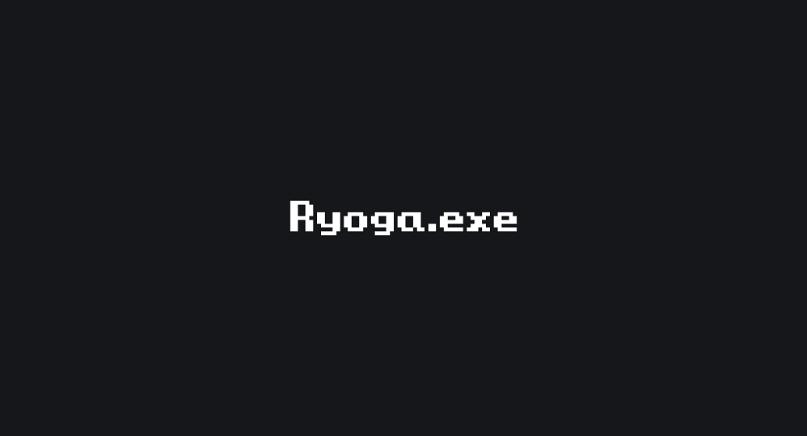

# Ryoga.exe's Website

[](https://ryoga.dev)
[](https://github.com/Ryoga-exe/ryoga.dev/actions/workflows/deploy.yml)
[](https://github.com/ryoga-exe/ryoga.dev/issues)
[](https://github.com/ryoga-exe/ryoga.dev/)

This is my portfolio site!
You can see [here](https://ryoga.dev)!

## Stack

- [Gatsby.js](https://www.gatsbyjs.com/) - A React framework

## Project structure

```
$PROJECT_ROOT
│   # 
├── pages
│   # 
├── src
│   # 
└── public
```

## OGP Image



## LICENSE

