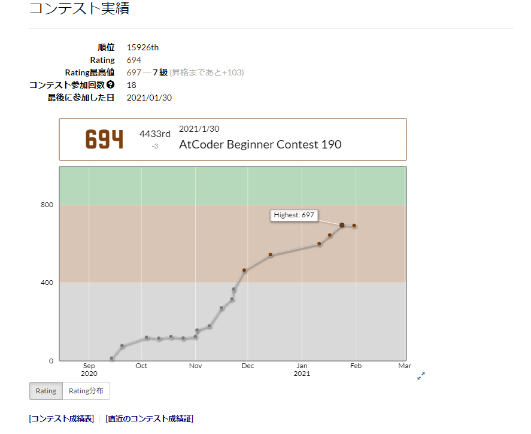

毎日日記を書くのは辛いし、かといってこのブログサイトをあまり更新しないのもなあ...　と思ったので月ごとに書くことにしました。
というわけで2021年1月を振り返ります。

## このサイトの更新等

ぼちぼちと更新しています。

Aboutページをいい感じにしたり、ヘッダーを改善したりしました。
まだ気に食わないところが結構あるのでもっと改善したい。こういうのはissueとかリポジトリのprojectsで管理してみようかな...

これからは、ヘッダー部分のレスポンシブ対応(ハンバーガーメニューに)やWorksページを充実、見た目の向上等をしたいです。

## 競プロ関連

年末年始あたりは用事があり、コンテストにほとんど参加できなかったのですが、約230くらいレートが伸びました！
しかし、1月最後のABC190で超失敗してしまったのがとても悔しいです...

今月でDPや累積和、いもす法には結構慣れてきて、ACを普通に取れるようになってきました。
用事が重なりあまり精進できなかったので新しく覚えたアルゴリズムはあんまりないです...

参加回数20回までには入緑したいところ。

## 新ノートPC

<blockquote class="twitter-tweet">
  
My new gear... <a href="https://t.co/aa8r9Z9P19">pic.twitter.com/aa8r9Z9P19</a>
&mdash; Ryoga.exe (@Ryoga_exe) <a href="https://twitter.com/Ryoga_exe/status/1347094175762632704?ref_src=twsrc%5Etfw">January 7, 2021</a>
</blockquote>

はい、ASUSのノートPCが年末のセールでかなり安くなったので買いました。
今メインで使っているデスクトップPCにはないOfficeが付いているのでいい感じ。実はABC190にはこれで参加しました。

いろいろとあってクリーンインストールする羽目になりましたが、現在はWSL2環境の整ったサブ開発機になりました！
Visual Studio CodeのRemote WSL拡張機能はいいぞ...

これでリモートワークが叫ばれる世の中に追いついた()

## 初当選

<blockquote class="twitter-tweet">
  
<a href="https://twitter.com/pronama?ref_src=twsrc%5Etfw">@pronama</a>  当選したプロ生ちゃんのグッズ届きました！ めちゃくちゃかわいい、やったー！<a href="https://twitter.com/hashtag/%E3%83%97%E3%83%AD%E7%94%9F%E3%81%A1%E3%82%83%E3%82%93?src=hash&amp;ref_src=twsrc%5Etfw">#プロ生ちゃん</a> <a href="https://t.co/pvJMNpPzKl">pic.twitter.com/pvJMNpPzKl</a>
&mdash; Ryoga.exe (@Ryoga_exe) <a href="https://twitter.com/Ryoga_exe/status/1355856129159389193?ref_src=twsrc%5Etfw">January 31, 2021</a>
</blockquote>

めちゃくちゃかわいいグッズが当たりました！

締め切りギリギリで応募したら当たってしまいました...(プロ生ちゃん自体は前から知っていたのですが、アカウントの存在は知らなかった)
こういうプレゼント企画自体初めて応募したので当選のツイートを見たときはすげえ驚きました。

## その他

スキーの大会などに参加したりしました。

あとは、開発している音ゲーのためのコントローラーの開発のためにPSoCを始めたり、GitHubでSimple IconsのissueにコメントしてOSSに貢献したりしました。(日頃の英語の勉強が役に立った！)

## 来月の目標、やりたいこと

とりあえず、AtCoder緑！
あとはこのサイトをもっと充実させる！

...そんな感じ