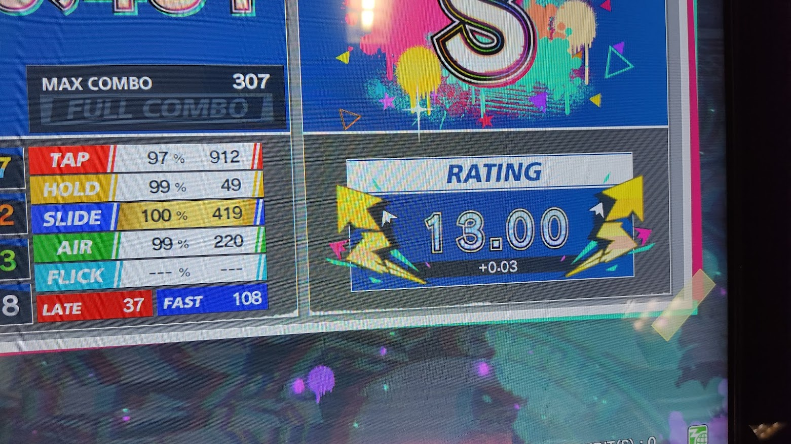

2021年6月を振り返ります。とても長く感じた。

## 競プロ関連

<blockquote class="twitter-tweet">
4桁！！！ 水パフォ！  Ryoga_exeさんのAtCoder Beginner Contest 206（Sponsored by Panasonic）での成績：1357位 パフォーマンス：1328相当 レーティング：957→1000 (+43) :) Highestを更新し、5 級になりました！<a href="https://twitter.com/hashtag/AtCoder?src=hash&amp;ref_src=twsrc%5Etfw">#AtCoder</a> <a href="https://twitter.com/hashtag/ABC206?src=hash&amp;ref_src=twsrc%5Etfw">#ABC206</a>（SponsoredbyPanasonic） <a href="https://t.co/Xz5txlfHof">https://t.co/Xz5txlfHof</a> <a href="https://t.co/GRVu2I6ZQc">pic.twitter.com/GRVu2I6ZQc</a>
&mdash; Ryoga.exe (@Ryoga_exe) <a href="https://twitter.com/Ryoga_exe/status/1406250133222608900?ref_src=twsrc%5Etfw">June 19, 2021</a></blockquote>

4桁になりました！！！嬉しい！

ABCトーナメントは初参戦して第三回戦まで進みました。

今月は、`UnionFind`の応用や二分探索、グラフ系問題の精進などを中心にやりました。

それと、友人らに競プロを布教しました。4人くらいがAtCoderを初めたので嬉しい。

## ゲーム開発等

<blockquote class="twitter-tweet">
できたー！！ 色を検知して、ブロック崩しのパドルを動かす   <a href="https://twitter.com/hashtag/OpenSiv3D?src=hash&amp;ref_src=twsrc%5Etfw">#OpenSiv3D</a> <a href="https://t.co/A4Ma7GvIRt">pic.twitter.com/A4Ma7GvIRt</a>
&mdash; Ryoga.exe (@Ryoga_exe) <a href="https://twitter.com/Ryoga_exe/status/1401098907195559938?ref_src=twsrc%5Etfw">June 5, 2021</a></blockquote>

ウェブカメラを使って遊んだりしました。このおかげで、OpenCVの使い方やOpenSiv3Dとの連携の仕方などが身に付きました！

それと、Sigmabeat2の進捗もまあまあありました！

その他で言えば、部活のウェブサイトを作り直したりしました。

## 英検二次

面接官が外国人で、「君の英語、ブリティッシュアクセントだね」的なことを言われた。

正直あまり意識したことはなかったし、なんなら自分はアメリカアクセントだと思っていた。

## その他

ギリ5月ですが、Siv3Dの[Organization](https://github.com/Siv3D) にJoinしました。

これもギリ5月ですが、Twitterのアイコンを変えました。かわいい

それと、最近始めたChunithmで銀レになりました。うおおおおおおお！

勧めてくれた友人氏が銀レだったのでついに追いついたぞ！という感じです。

## 来月の目標、やりたいこと

AtCoder、入水！

...そんな感じ