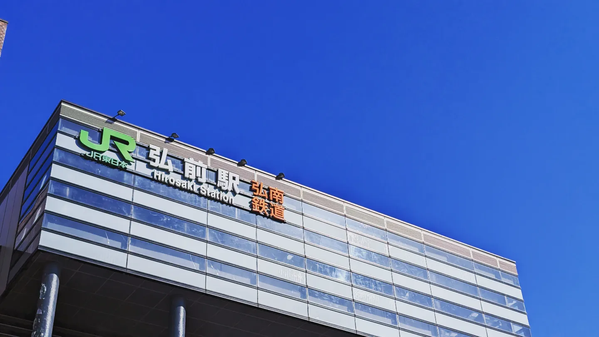

# 2023 年を振り返る

年の瀬ですね。2023 年ももうすぐ終わろうとしており、TL にぞくぞくと今年の振り返りのブログ記事が流れてきているのでそれに触発されて私も書いてみようと思います。
なんだかんだで濃い 1 年でした。

## 大学入学まで

研究だったりスキーだったりをしていました。スキーについてはインターハイと国体に出場するなどしました。
山形と岩手だったため、東北地方まで飛んでいったわけですが観光もちょっとできてとても良かったです。普通に楽しかった。
帰りに青森まで行ってから仙台によって仙台に住む友人氏に仙台市内を案内してもらったのはいい思い出です。それと東北自動車道の終端を見れたのは面白かった。

3 月になると高校を卒業しました。中高時代を振り返るクソ記事をバーーッと書いたりしました。

その他には情報処理学会全国大会で電気通信大学に行ったり、東北旅行をしたり台湾・福岡旅行をしました。

個人的に好きな写真、なんかいい感じに撮れた

福岡はかなり良かったです。飯がうまくて良かった…

旅行の計画を含め旅行は私はあまり向いていないなあと感じたりもしました。当分はどっかに飛んでいくのはいいかなと思ったり…楽しいんですけどね。
旅行というのは楽しいが疲れるなぁということを実感しました。次はもうちょっと慣れてから、頑張ります。

## 大学

筑波大学情報学群情報科学類に 4 月に入学してなんとか学生をしています。
自然と仲間というのはできていくなという感じで入学してすぐパソカタの友人ができました。

大学内の情報系コミュニティにもいろいろと顔を出して多くの人と交流をすることができました。
入学する前はぼっちを覚悟していたところもあるのでちょっと安心です。よかった…
周りに強いオタクが多いとやはり良いですね。入学前に聞いたことある方々と話せてびっくり。

かなり影響を受けた部分もあったりして今年から始めて触った技術だったり趣味だったりが結構あります。
周囲の情報系オタクは思想強めの人が多く、私もより思想強めな技術を積んだなぁという感じでした。おそらく来年はもっと思想ゴリゴリになっていそうな…

それと同時に強くなりてぇ～という気持ちも大きくなって自己研鑽しなきゃなあという感じでいます。

ただ、情報系コミュニティ以外であまり大学の友人を作れていない、というところはあります。
交流が全くないというわけではないのですが、大学垢で流れる TL を見て「うっっ」とダメージを受けています、拗らせすぎですね。
来年は他学類の友達をもうちょっと作るとか目標にするといいのかもしれません…
他学類のこととか知りたいし、普通にいろいろと話してみたいのでね…
ところで、創作系強い人多すぎませんか？ (絵だったり作曲だったり)…そういった人たちにある種の憧れを持っているので話してみたさがあります。

大学でのやらかしというとやはり入学してすぐの TOEIC テストの寝過ごしです…あのときは絶望でしたが幸い (？) 一つ上の先輩に同じやらかしをしている人がいたのでいろいろと助言をもらい、なんとかなりました。というか受験しなくてもなんとかなる設計でした。
結局英語のクラスは一番下 (多分、というか確実に) になったわけですが、授業・課題が軽くて結果オーライみたいなところがあります。まあ物足りないといったら物足りない感じなのですが…

その他には雙峰祭関連を頑張りました。ティザーサイトを Astro で書き直したり、アクセシビリティを見直したり、当日の本番サイトを実装したりなどしました。特に一番最後に挙げたものが大変で相当鍛え上げられました。

授業は春はとてもやる気があったので B 以下は一つだけといった感じでそれなりに頑張ったなぁと思っています。秋に入ると反動でめちゃくちゃになってしまいましたが…

## 生活

なるべく自炊しようという気持ちはあるのですがどうしても続かずに食生活が破滅してしまいます。本当にどうにかしたい。
料理自体は好きで楽しいのですがどうしてもやる気が…

それと日記を付け始めました、なんとか 3 か月くらいは続いているのですが直近 1 か月がバタバタしていたので無いです。来年はさすがに続けたい。

## 競プロ

がっつりとはできませんでした。ABC にはたくさん出れました。
夏くらいから大学の coins ラウンジに集まって友人氏と ABC に出るということを続けていて、終わったあとに即聞ける環境は良いです。橙コーダーさんに助けられまくりです。
来年はさすがに色を 1 つか 2 つは上げたいです。さすがに

ヒューリスティックについては入青を達成しました。しかし、最近長期コンテストに出る時間が無く、出れていないので、来年はたくさん出たいなと思っています。

ICPC はなんとかチームを組むことができて予選を頑張りました。割と惜しいところまで行けたので来年か再来年はどうにか横浜までに進みたいですね…

その他にはオンサイトコンテストに参加してみたりなどしました。UTPC・Maximum-cup・TTPC などに参加しました。ITF.PC では初めて作問・運営をしました。面白すぎたので来年も何か問題を出したいですね… (そもそもやるかどうかよくわかってないけど)

## CTF

同期に CTF 人間がたくさんいたので影響されて今年から始めました。
Web 問を主にやっています。OSINT とかも好きです。

今年は SECCON に出ました。チームメイトに助けられまくりです。
Final では不安なところがたくさんありましたがなんとか終了間際ギリギリに解法がわかりチームに貢献することができました。結果は国内 5 位でした。チームメイトのみなさんつよつよすぎて感謝しまくりです。来年は強くなってもっと解いて貢献したいなと思いました。

CTF 楽しい～になっているので多分来年も続けます、というか競プロより楽しくなってしまっているところがあります…
両立してどっちも強くなりたい…

## ISUCON 13

ISUCON は今回が初参加でした。
Golang で参加したのですがまじで今年に入ってから触り始めたくらいの理解度だったのでかなり不安でしたがなんとかなりました。結局大会中は App の改善ばかりをしていて N+1 解消しまくり人間になっていました。スコアがぐーんと上がる瞬間はやはり気持ちがよかったです。

結果は全体 25 / 694 位、学生 5 位でした。チームメイトに感謝しまくりです。

## 作ったもの

雑に今年作ったもので Public なインターネットに放流したものをまとめます。

### [checkbox-qr](https://repos.ryoga.dev/checkbox-qr)

チェックボックスで QR コード書いたらおもろいんじゃね？という思い付きで一晩で実装したものです。使い道はよくわかりません…

### [irodukanai-manaba](https://github.com/Ryoga-exe/irodukanai-manaba)

これも使い道はよくわかりません。manaba から色を消す拡張機能です。
iroduku-manaba が作られていたのでそれに逆張りするような拡張機能、おもろくない？という思い付きで実装したはいいんですがマジで `filter: grayscale(1);` という CSS をあててるだけなんですよねこれ。

まあ Plasmo の良さを知れたし、なにせ初めてのブラウザ拡張機能の開発だったので勉強になりました。

### [umesh](https://github.com/Ryoga-exe/umesh) (WIP)

Go で書いている自作シェルです。OS とかを自作するのはよく聞くけどシェルを自作するのはあんまり聞かないなぁということで作ってみた感じです。ただ全然まだ途中だし、構文解析のフェーズが入ってきてしまったのでまず先に簡単なコンパイラから自作して、慣れてからガッと作りたいなの気持ちが出てきています。

乱数を引いて Go で実装することにしたのですがちょっと辛いです、普通に C とか Rust で良かった

### [tweet-counter-static](https://github.com/Ryoga-exe/tweet-counter-static) / [tweet-counter-extension](https://github.com/Ryoga-exe/tweet-counter-extension)

コンテンツ入門というレポートがツイートな意味のわからない授業を取ったのですが、「API が使えなくなちゃったからいい感じのツイート数を数える方法考えてね！」といった課題が出たので作りました。
使い方とかは README を読んでください。

### [css-monte-carlo-pi](https://github.com/Ryoga-exe/css-monte-carlo-pi)

CSS だけでモンテカルロ法を用いた円周率の近似を実装したぜ！という頭のおかしいやつです。割と実装してて楽しかった思い出があります。

この内容は LT で喋ったり、[記事](https://qiita.com/Ryoga-exe/items/67408b57dd7d4a18aa9d)にしたりしました。

### [Siv3D-Actions](https://github.com/Ryoga-exe/Siv3D-Actions)

[Siv3D Advent Calendar 2023](https://qiita.com/advent-calendar/2023/siv3d) 用に作ったものです。GitHub Actions と仲よくなれました。

## その他

2023 年は Web 関連の技術をやりまくっていた印象があります。(仕事でも非仕事でも)

Astro を初めて触ったのですがとてもよくていろいろなところで使っています。最近はいい感じの i18n-integration を書こうと模索しています。

入学当初は低レイヤやりたいだったので来年はもっと低いレイヤをやろうかなと思っています。結局業務とか雙峰祭関連で高いレイヤをやることになりそうだけど

そのほかにはコミケに初めて参加したりなどしました。想像の倍以上人が多くてびっくりでした。来年はもっとこういったイベントに参加たいな…

## 2024 年の目標とか

健康に生きる・強くなる
